# GDSC Technorave - Digital Odyssey Game Codebase

Hey there! This repository consists of the codebase for the Digital Odyssey Game Event conducted by GDSC CBIT as part of Sudhee 2024.

## Game/Event overview

Digital Odyssey is the first round of the event Technorave. It is similar to a treasure hunt, we call it a digital treasure-hunt. The participants need to solve for clues to form a passcode and clear the round.

**Find the detailed Abstract here** - [Digital Odyssey - Abstract](https://docs.google.com/document/d/17-14PlJpUP95TGiW2UwHveRB1_-tbMeOAF5WX9XBJBU/edit?usp=sharing)

### Work Credits

Our team at GDSC CBIT worked on curating the questions. [Questions Repository](https://github.com/Sricharan2k3/round-1-htmls)

I (gjaynir0508 - Jayanth) handled the development and administration of the game site.

## Instructions for replicating

You are free to clone/fork and experiment with this codebase.

### Getting your copy work

The project depends on [Vercel Storage](https://vercel.com/docs/storage) services (as I wanted to try them out).
So, to get started quickly, clone or fork and clone this repository and create a new Vercel project with Storage enabled.
Specifically, we will need the [Vercel Postgres Database](https://vercel.com/docs/storage/vercel-postgres) and [Vercel Edge Config Store](https://vercel.com/docs/storage/edge-config). Once they are ready, populate a `.env` file with required Environment variables manually or just follow the docs and use the CLI to automatically populate it (you can also see the instructions even on Vercel Dashboard > {Your Project} > Storage > {storage} > Get started - Next JS)

Once the project is connected with Vercel Storage, use the utility functions in `src/lib/manageDB.ts` to populate the Postgres Database

(or)

Use the `/admin/manual/pushQuestions` route (`src/app/admin/manual/pushQuestions/route.ts`) to push the questions for `s12` set.

Then, add the following to the Edge Config.

```json
{
  "nextTime": "2024-02-26T04:30:00.000Z",
}
```

Now, run the app locally with `npm run dev`. This will now show a waiting screen.
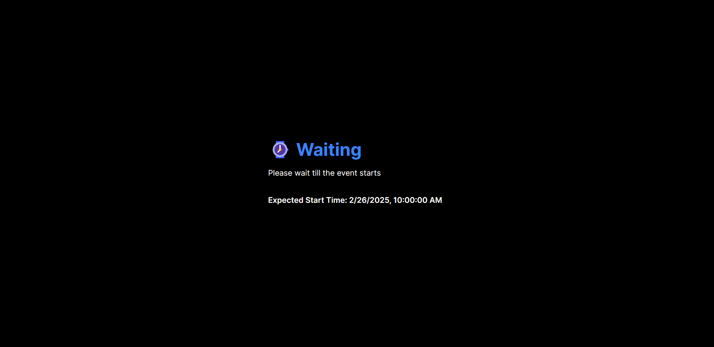

Update the Edge Config to below values

```json
{
  "passkey": "3adGDsc",
  "session": "s12", // change it to <session-folder-name> depending on questions you pushed.
  "allowNew": "true",
  "allowRelogin": "true"
}
```

Wait for it to take effect and reload the page.

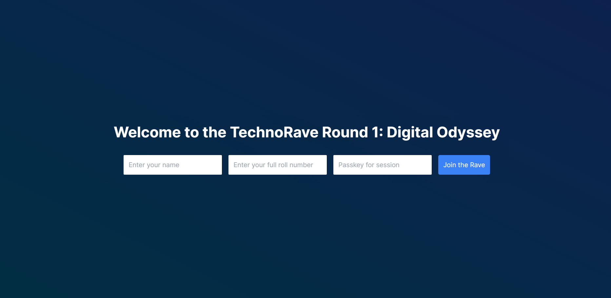

Whoa! Now, you can login and try solving.

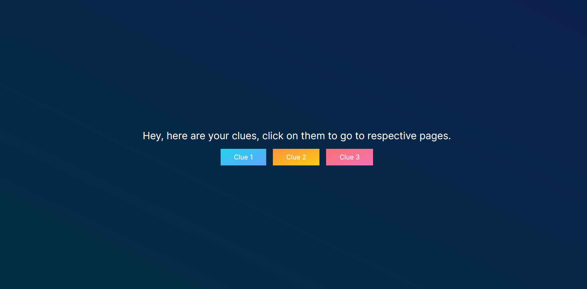

Visit each clue by using the link buttons.

On the last clue page, inputs to submit answers can be found.

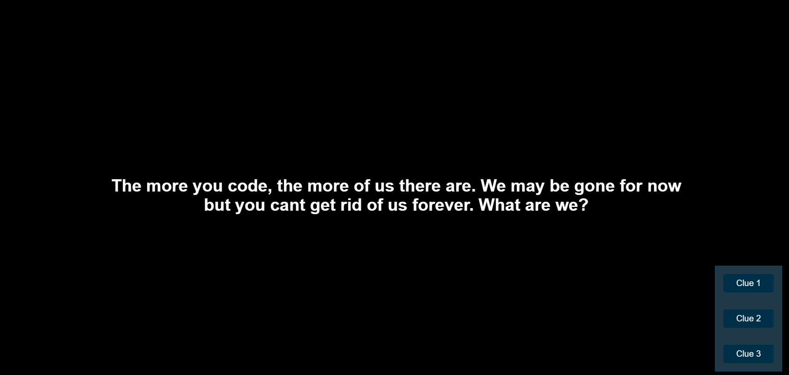
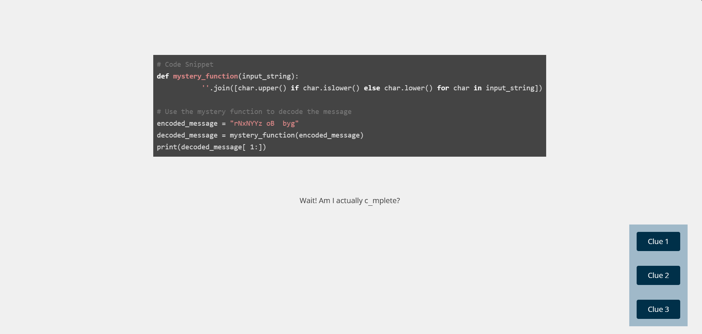
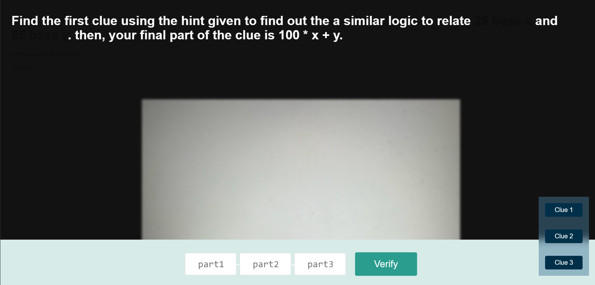

Each clue forms a part of the passcode, Clue 1 => part 1, Clue 2 => part 2 and Clue 3 => part 3
You can enter each part and go back and forth. The input value will be remembered (sadly not on FireFox as it doesn't support cookieStore but you can still submit).

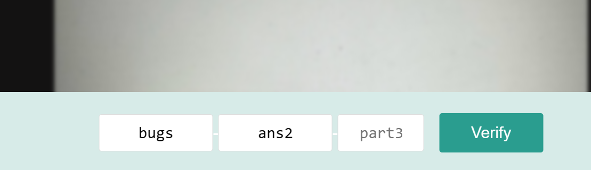

To verify your answer, fill all the inputs with some answer and click on **Verify**

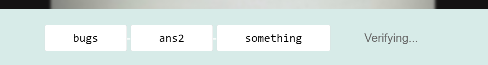

If a part is correct, it gets locked and you can just focus on other parts.

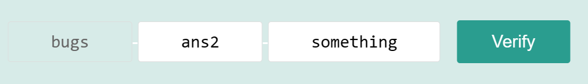

Once the correct passcode is submitted, congratulations screen is shown

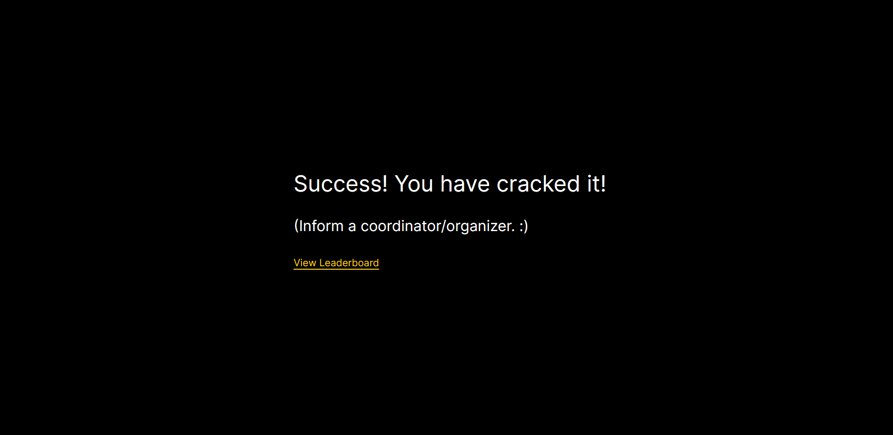

You can access the Leaderboard at `/leaderboard` route.

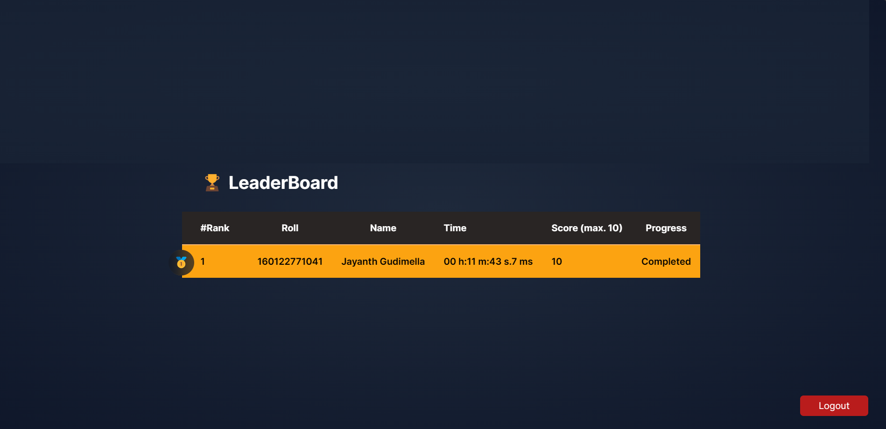

Congratulations on completion. You can logout and login with another name and roll number and try to populate the leaderboard.

Sample leaderboard from one of the sessions

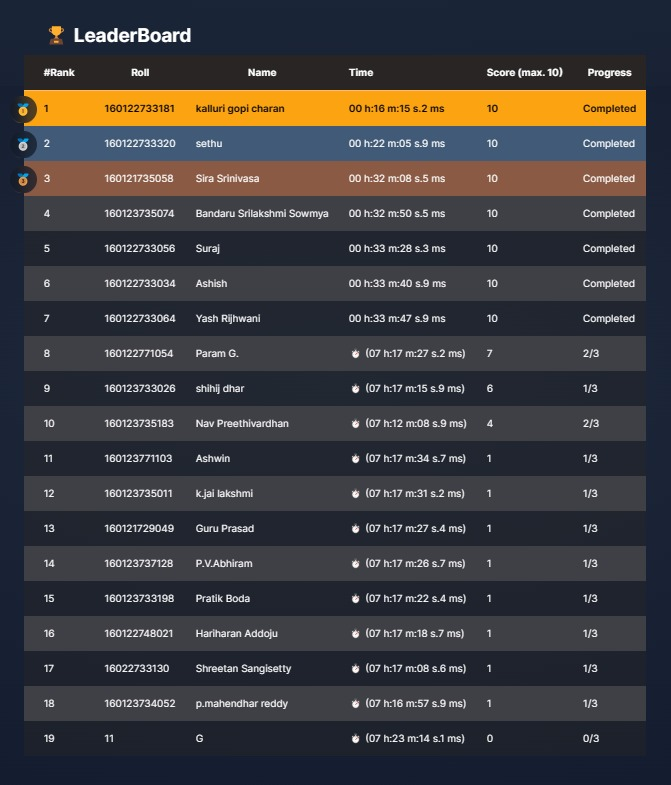

Different error states have been handled. You can try to break the site flow and see how it responds. If you have any suggestions, feel free to let me know on [X (Twitter) - @gjaynir0508](https://x.com/gjaynir0508)

### Understanding how it works

1. **Questions**: The questions were curated by our team at GDSC CBIT in the form of HTML Pages (optionally linked with some images, stylesheets and scripts stored in `/public` directory). The questions' HTML files are stored under `src/questions` folder, distributed into various sets. Each set consists of a few Level 1, Level 2, and Level 3 questions (specified by the `qdiv.json` file in each set's directory). These are combinatorically paired to form a set of 3 questions one from each level using `createCombinationsForAllSets` function from `src/lib/manageQuestions.ts`, this also generates the corresponding passcode for each combination using the answers from `qa.json` file in each set's directory.

2. **Database**:
    1. Storing Questions: All the combinations of questions are then stored in an SQL database. For this project, I wanted to try out Vercel's PostgreSQL (part of Vercel Storage) service. The data is stored in `s1` table as

    | id  | clue1 | clue2 | clue3 | passcode | ... |
    | --- | ---   | ---   | ---   | ---      | --- |

    Each combination is given an id for ease of access. `clue1`, `clue2`, and `clue3` represent the name of HTML files for each question, which can then be accessed using path `src/questions/{session}/{clueN}.html`.

    2. User data: Once the user logs in with full name and roll number as credentials, the next available combination is assigned to the user (player) and data is populated in the `s1` table as

    | ... | name | roll | starttime | endtime | status | progress | time | score |
    | --- | ---- | ---- | --------- | ------- | ------ | -------- | ---- | ----- |

    time = endtime - starttime, status is one among {started, complete}, progress is the number of questions/clues successfully cracked, score is the respective score achieved (Level 1 = 1, Level 2 = 3, Level 6 = 6)

3. **Edge Config**: The Vercel Edge Config was utilized to maintain different states (waiting for event to start, session id, passkeys to prevent people outside event from joining, allowing/disallowing new people to join, relogin etc.,)

4. **Session Management**: The site uses Cookies 🍪 to manage user sessions. Although not the best or the safest solution, it was the easiest to implement given the time constraint

## Default Text from Next JS app initialization

This is a [Next.js](https://nextjs.org/) project bootstrapped with [`create-next-app`](https://github.com/vercel/next.js/tree/canary/packages/create-next-app).

## Getting Started

First, run the development server:

```bash
npm run dev
# or
yarn dev
# or
pnpm dev
# or
bun dev
```

Open [http://localhost:3000](http://localhost:3000) with your browser to see the result.

You can start editing the page by modifying `app/page.tsx`. The page auto-updates as you edit the file.

This project uses [`next/font`](https://nextjs.org/docs/basic-features/font-optimization) to automatically optimize and load Inter, a custom Google Font.

## Learn More

To learn more about Next.js, take a look at the following resources:

- [Next.js Documentation](https://nextjs.org/docs) - learn about Next.js features and API.
- [Learn Next.js](https://nextjs.org/learn) - an interactive Next.js tutorial.

You can check out [the Next.js GitHub repository](https://github.com/vercel/next.js/) - your feedback and contributions are welcome!

## Deploy on Vercel

The easiest way to deploy your Next.js app is to use the [Vercel Platform](https://vercel.com/new?utm_medium=default-template&filter=next.js&utm_source=create-next-app&utm_campaign=create-next-app-readme) from the creators of Next.js.

Check out our [Next.js deployment documentation](https://nextjs.org/docs/deployment) for more details.
